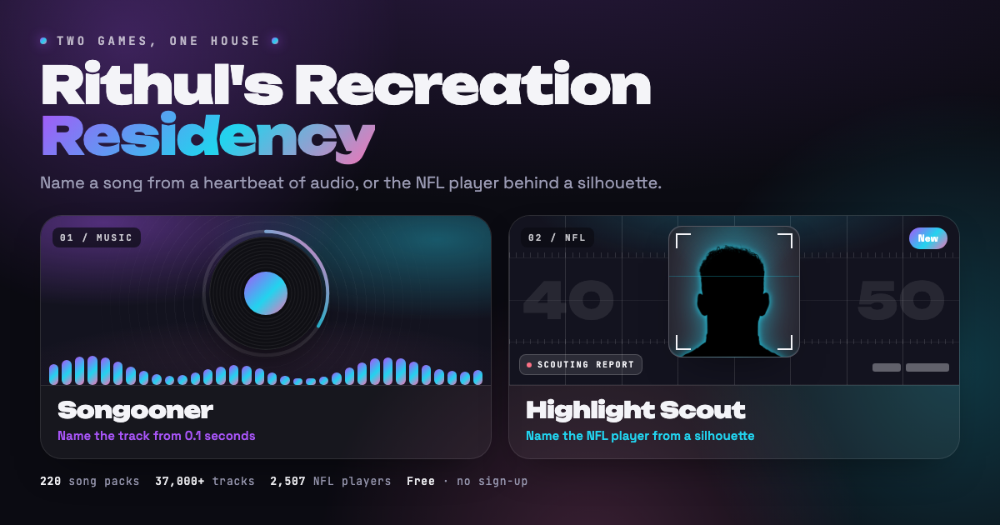

# Rithul's Recreation Residency

A personal arcade. Two games, one site, no accounts, no backend.

**Play: https://rithulbhat.github.io/recreation_residency/**



## 🎧 Songooner — name the track from 0.1 seconds

A guess-the-song game that goes well past Songspot and Heardle.

| | Songspot | Songooner |
|---|---|---|
| Clip lengths | 5 fixed stages | **0.1s to 10s** on a log slider, or your own escalating stages |
| Tries | Fixed | 1–6 per song, plus hints (year, initials, cover peek, first letter) |
| Catalogue | 5 genres | **220 verified packs, 37,000+ songs** across genres, decades, 38 regions and languages, 77 artists, vibes, soundtracks and charts |
| Custom packs | No | Any Deezer artist, playlist link, album or search term |
| Modes | One | Classic, Fixed clip, Blitz, Survival, Duel (same device or **online room codes**), Party for 2–8, Daily, Challenge links |
| Audio tricks | None | Reverse, 0.5×–2× speed, pitch shift, lo-fi, 8-bit bitcrush, via real Web Audio |
| Voice | None | **Say your guess**, plus a voice host with four personalities |
| Progression | None | Score by clip length, tries, speed and streak; 14 ranks, 53 achievements, a generated share card |

## 🏈 Highlight Scout — name the NFL player from a shadow

Seven ways to be shown almost nothing and still be expected to know.

- **Silhouette** — a rim-lit shadow, with the face emerging from the chin up while the hair stays black longest
- **Face Off** — an extreme crop on one feature, zooming out each try
- **Film Room** — a real play-by-play line with every name redacted
- **Franchise IQ** — a clue ladder about a team, most obscure first
- **Stat Sheet** — a season stat line filling in one number at a time
- **Draft Board** — draft year, round, pick, college, team
- **Logo Zoom** — a team mark, far too close

Backed by **32 teams, 2,507 players and 1,700 real plays**, refreshed with `npm run nfl:sync`.
Difficulty comes from a recognizability score built from Pro Bowl and All-Pro selections, major
awards, draft pedigree and national profile, so the easy tier is genuinely the faces you know.
Where an official NFL or team highlight exists, the reveal links you straight to the tape.

## Develop

```bash
npm install
npm run dev              # http://localhost:5173
npm test                 # Vitest unit tests
npm run e2e              # Playwright (real Deezer, ESPN and PeerJS)
npm run build            # typecheck + production build
npm run catalog:verify   # re-verify every music pack against Deezer
npm run nfl:sync         # re-harvest the NFL dataset from ESPN
```

Pushing to `main` deploys to GitHub Pages via `.github/workflows/deploy.yml`.
Architecture, contracts, scoring and the data constraints live in [CLAUDE.md](CLAUDE.md).

## Notes

- Not affiliated with Deezer, the NFL or ESPN. Song previews stream on demand from Deezer and
  expire after about 15 minutes, so they are refreshed automatically. NFL rosters, headshots and
  play-by-play come from ESPN's public endpoints and are baked at build time, because those
  endpoints send no CORS headers and a browser can never call them.
- Highlight clips are embedded from official NFL and team YouTube channels. Most uploaders block
  third-party playback, so those open on YouTube instead.
- Online duels use PeerJS public signalling with no TURN relay, so some strict networks cannot
  connect peer to peer. Same-device duel always works.
